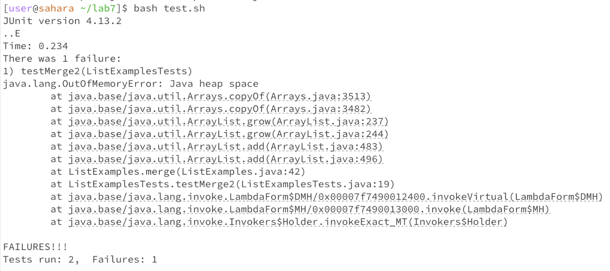
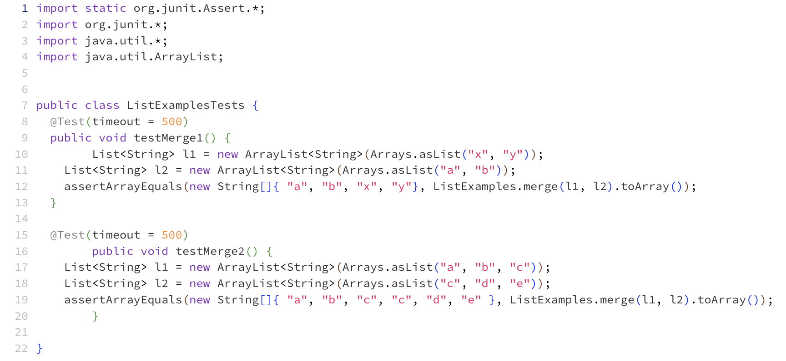
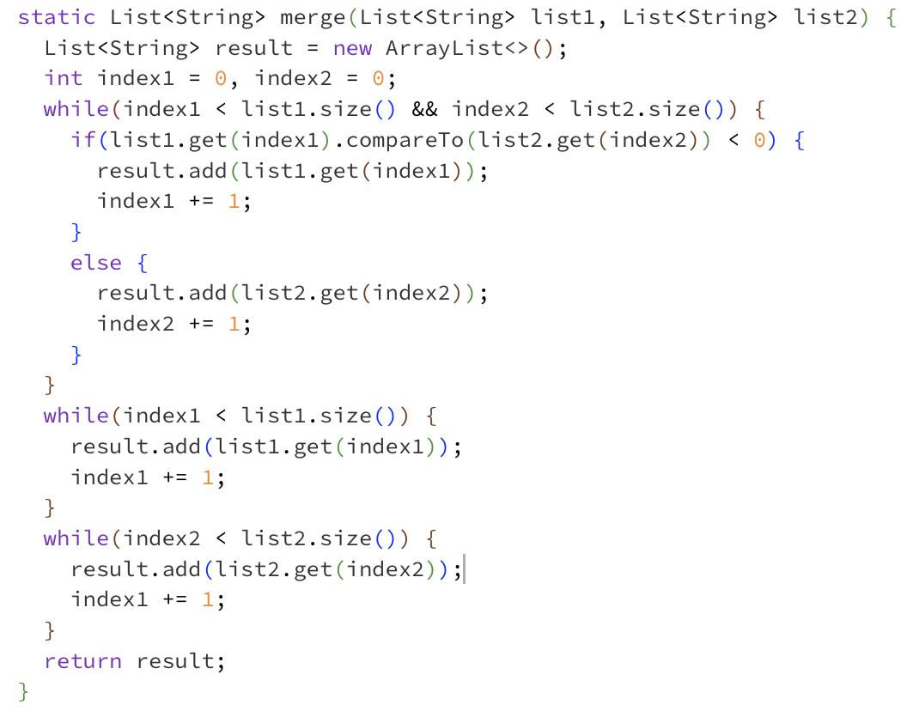

# Part 1 - Debugging Scenario

1. EdStem Post
After I programmed the grading script and ran it with `ListExamplesTests.java`, I keep getting this message that there was a failure in one of the tests, but I'm not sure how I should go about finding the bug. 

I know that the problem is somewhere in with the second test in `ListExamplesTests.java`, but I'm not sure what or where exactly the bug is. Below I have attached a screenshot of the tests that were ran and the merge function that is used in the test.. Any suggestions on how to approach this?

3. TA Response
Hi Jonathan,
As you can see from the error message, the problem lies somewhere in the second test. Look at the two tests. What are the differences between them? Try comparing the two tests and figuring out why one of them passes but the other fails. If you cannot figure it out, feel free to send a followup message.

4. 

# Part 2 - Reflection
