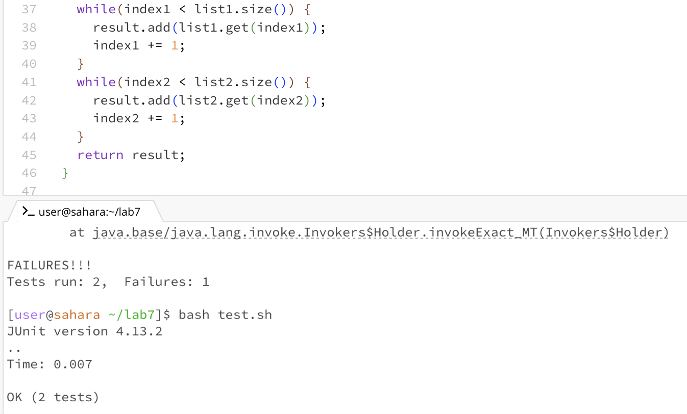
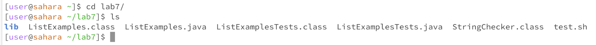
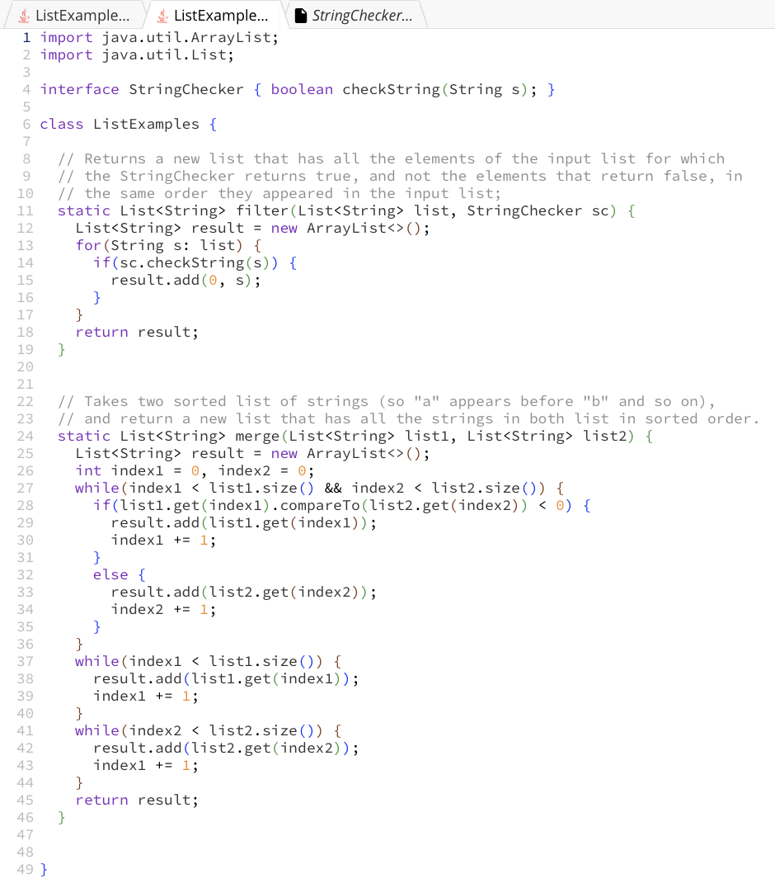
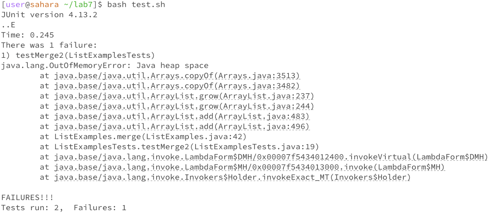

# Part 1 - Debugging Scenario

1. EdStem Post
* After I programmed the grading script and ran it with `ListExamplesTests.java`, I keep getting this message that there was a failure in one of the tests, but I'm not sure how I should go about finding the bug. 

I know that the problem is somewhere in with the second test in `ListExamplesTests.java`, but I'm not sure what or where exactly the bug is. Below I have attached a screenshot of the tests that were ran and the merge function that is used in the test.. Any suggestions on how to approach this?

2. TA Response
* Hi Jonathan,
As you can see from the error message, the problem lies somewhere in the second test. Look at the two tests. What are the differences between them? We can see that there is a problem with the merge function that causes the second test to fail but passes the first test. Try comparing the two tests and figuring out why one of them passes but the other fails.  If you cannot figure it out, feel free to send a followup message.

3. After reading the message from the TA, I realized the bug was in the merge function rather than any of the tests. When looking through the merge function, I noticed that the variables index1 and index2 were assigned to list1 and list2 respectively. So for list 1, index 1 would be incremented and the same with list 2. However, in one of the while loops in the merge function, when using list 2, index 1 was being incremented. I changed index1 to index2 in that specific loop, and when rerunning the bash script, all of the tests passed. 

4. 
* Directory Structure

* Contents of files before fix
`ListExamplesTests.java`

`ListExamples.java`

* Command Line to trigger the bug

* Bug Fix Description
From the TA's response, I figured out that the bug was in the merge function, not the tests themselves. After going into `ListExamples.java`, I noticed that the variables index1 and index2 were assigned to list1 and list2 respectively. So for list 1, index 1 would be incremented and the same with list 2. However, in one of the while loops in the merge function, when using list 2, index 1 was being incremented. I changed index1 to index2 in that specific loop, and when rerunning the bash script, all of the tests passed. 

# Part 2 - Reflection

* My favorite things that we learned during the second half of the class were vim and jdb. Though I'm still struggling to understand jdb, I understand a lot more than I did when we first started the class. However, I found editing code with vim to be pretty easy and interesting to learn. After learning all of the key functions, editing with vim is so much faster and easier. It was also kind of fun to try to speed run with vim. 
